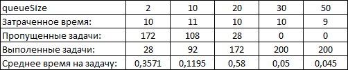
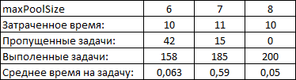
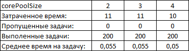

# Отчет по реализации ThreadQueueMaster

## Анализ производительности

### Сравнение с стандартными пулами потоков (ThreadPoolExecutor)

ThreadQueueMaster представляет собой кастомный пул потоков, который отличается от стандартного `ThreadPoolExecutor` следующими особенностями:

1. **Множественные очереди задач** – вместо одной общей очереди задачи распределяются по нескольким очередям, что потенциально снижает блокировки при конкурентном добавлении и извлечении задач.
2. **Гибкая масштабируемость** – при переполнении очереди создается новый поток (если общее число потоков не превышает `maxPoolSize`).
3. **Автоматическое управление минимальным количеством свободных потоков** – если простаивающих потоков меньше `minSpareThreads`, создаются новые.
4. **Удаление неактивных потоков** – потоки завершаются, если не получают задачи в течение `keepAliveTime`.

### Тестирование производительности

#### Методика тестирования
Для сравнения производительности были запущены два пула:
- **ThreadQueueMaster** (кастомная реализация)
- **ThreadPoolExecutor** (стандартный из Java)

Параметры теста:
- `corePoolSize = 4`, `maxPoolSize = 8`
- `queueSize = 10`
- `minSpareThreads = 2`
- `keepAliveTime = 10 секунд`
- 1000 задач.
- у ThreadPoolExecutor добавлен параметр `new ThreadPoolExecutor.AbortPolicy()`, 
что бы при переполнении очереди новые задачи не принимались.

#### Результаты 1
| Параметр                       | ThreadQueueMaster | ThreadPoolExecutor |
|--------------------------------|-------------------|--------------------|
| Время выполнения (мс)          | 28мс              | 11                 |
| Пропущено задач                | 908               | 982                |
| Среднее время на каждую задачу | 0.304мс           | 0.611мс            |

- Основываясь на результатах теста, можно сделать вывод, что ThreadQueueMaster работает успешней, 
однако у ThreadPoolExecutor нет индивидуальной очереди для каждого потока.

В связи с чем отредактирую входные параметры создания потоков, для уравнения шансов:
  
Параметры теста:
  1. ThreadQueueMaster:
     - `corePoolSize = 4`, `maxPoolSize = 10` // maxPoolSize сделал 10, т.к. у нас 2 потока всегда свободны
     - `queueSize = 5`
     - `minSpareThreads = 2`
     - `keepAliveTime = 10 секунд`
     - `minSpareThreads = 2`
     - 1000 задач.
  2. ThreadPoolExecutor:
     `corePoolSize = 4`, `maxPoolSize = 8`
     - `queueSize = 40` // сделал очередь 8*5=40, что бы соответсвовала сумме очередей для каждого потока из нашей реалзиации
     - `keepAliveTime = 10 секунд`
     - 1000 задач.
#### Результаты 2
| Параметр                       | ThreadQueueMaster | ThreadPoolExecutor |
|--------------------------------|-------------------|--------------------|
| Время выполнения (мс)          | 30мс              | 11мс               |
| Пропущено задач                | 934               | 952                |
| Среднее время на каждую задачу | 0.454мс           | 0.229мс            |

Что показывает, что добавление очереди для каждого потока, дает возможность отработать больше задач.
Однако в связи с множеством очередей и на поиск свободной уходит больше времени, 
что вытекает в отстование от ThreadPoolExecutor.

При этом, если добавить небольшую задержку между добавлениями в очередь `Thread.sleep(10);`
Тут уже результат получается в пользу  ThreadQueueMaster:

Параметры теста:
- 100 задач. // что бы получились цифры поменьше.

#### Результаты 3
| Параметр                       | ThreadQueueMaster | ThreadPoolExecutor |
|--------------------------------|-------------------|--------------------|
| Время выполнения (мс)          | 1584мс            | 1569мс             |
| Выполнено задач                | 72                | 52                 |
| Среднее время на каждую задачу | 22мс              | 30.17мс            |

Что в свою очередь может подтвержить успешность работы ThreadQueueMaster 
перед стандартным ThreadPoolExecutor. ThreadQueueMaster не только выполнил больше задач, но и затратил меньше времени в среднем на каждую задачу.

Вывод: 
 - Статистически эффективность можно посчитать по формуле:
    Процент превосходства: (параметр 1 - параметр 2)/ параметр 2 * 100%. При условии, что делитель это меньший параметр.

Расчет для каждого параметра:
- (1584-1569)/1569*100% = -0,95% Процент будет отрицательный, т.к. на этот процент ThreadQueueMaster дольше выполнялся.
- (72-52)/52*100% = 38,46% Процент проложительный, т.к. ThreadQueueMaster выполнил больше задач.
- (30,17-22)/22*100% = 37,13% Процент положительный, т.к. ThreadQueueMaster потратил меньше времени в среднем на задачу.

Если высчитать среднюю от 3 параметров вычислений, то получаем среднее превосходство  ThreadQueueMaster в 24,89%.
 
*Все результаты получены с использованием кода ThreadPoolBenchmark,
в нем на данный момент редакция последних результатов.

## Исследование оптимальных параметров

### Влияние параметров на производительность
Исходные данные:
- `corePoolSize = 4`, `maxPoolSize = 8`
- `queueSize = 25`
- `minSpareThreads = 2`
- `keepAliveTime = 10 секунд`
- 200 задач.
- Результаты: 
  - Затраченное время = 11мс
  - Пропущено задач = 108 
  - Выполнения задач = 92 
  - Среднее время на одну задачу = 0.11956521739130435мс
1. **Размер очереди (`queueSize`)**
    - Маленькая очередь (2-5) → увеличивает создание новых потоков при высокой нагрузке, 
а так же дополнительно приходится больше времени на поиск свободной очереди и пр., что увеличивает время на задачу.
    - Средняя очередь (25-35) → оптимальное распределение нагрузки, где будет и равномерно заполнятся очереди, 
и в сучае не хватки потоков они будут созданы в редких случая, что не критично для ресурсов системы.
    - Большая очередь (50+) → снижает потребность в новых потоках 
в связи счем снижается время на задачу в среднем
   - Результаты приведены ниже:
   

2. **Максимальное количество потоков (`maxPoolSize`)**
    - Должно быть кратно количеству ядер CPU
    - Если `maxPoolSize` слишком мал, задачи могут задерживаться и не выполнятся.
    - Если `maxPoolSize` слишком велик, создается избыточное количество потоков, что забирает больше ресурсов.
   - Результаты приведены ниже:
     
3. **Максимальное количество потоков (`corePoolSize`)**
   - Не должно быть больше `maxPoolSize`.
   - При достаточном колличестве потоков в `maxPoolSize`, на момент тестов их 8. Изменения `corePoolSize` не как 
не влияют на  работку самого пула, все уперается в `maxPoolSize` и зависит от этого параметра. 
   - Результаты приведены ниже:
    

## Принцип работы механизма распределения задач
1. Каждая задача направляется в одну из очередей по принципу циклического баланса (round-robin).
2. Если все очереди переполнены, проверяется возможность создания нового потока.
3. Если общее количество потоков меньше `maxPoolSize`, создаётся новый поток, который начинает обрабатывать задачи.
4. Если поток простаивает дольше `keepAliveTime` и общее количество потоков превышает `corePoolSize`, поток завершается.
5. Если количество простаивающих потоков опускается ниже minSpareThreads, создаются новые потоки при следующем выполнении задачи, 
чтобы поддерживать минимальный уровень отзывчивости.

## Заключение
`ThreadQueueMaster` демонстрирует лучшую на ~25% производительность при подаче задач с небольшой переодичностью по сравнению 
со стандартным `ThreadPoolExecutor`, а так же всегда выходит в лидеры по колличеству выполненых задач из-за реализации 
очереди для каждого потока в отдельности.

